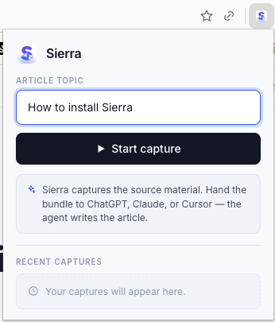
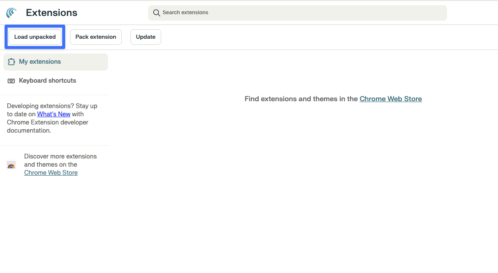
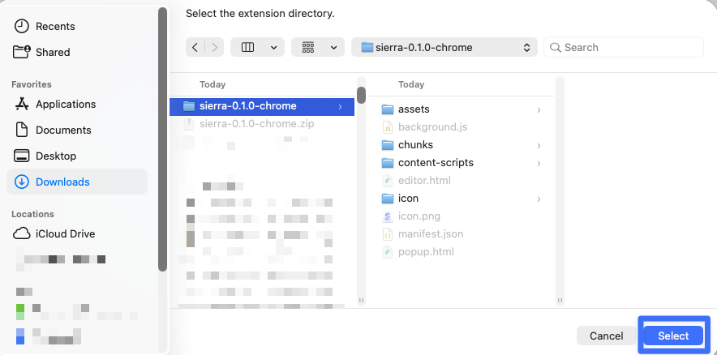
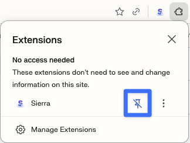

# Sierra

<p align="center">
  
</p>

<p align="center"><strong>Capture kit for AI article writers.</strong><br/>Record any click-through and hand the annotated bundle to your AI agent.</p>

---

## What it does

Sierra turns your clicks into a clean, annotated walkthrough. Instead of writing step-by-step tutorials by hand, you **perform the task once** — Sierra captures each click as a screenshot with context, and bundles it for your AI agent to write the article.

<p align="center">
  
</p>

## How it works

1. **Name the article** and click **Start capture** in the Sierra popup.
2. **Walk through the task** in any tab. Sierra records each click as an annotated screenshot.
3. **Stop capture**, then open the editor to review, reorder, or delete steps.
4. **Export the bundle** and hand it to ChatGPT, Claude, or Cursor — the agent writes the article.

## Install

Download the latest zip from the [Releases page](https://github.com/nguyeehub/sierra-user-guide-creation/releases/latest), then:

**1. Open `chrome://extensions` and enable Developer mode.**

<p align="center">
  
</p>

**2. Click Load unpacked.**

<p align="center">
  
</p>

**3. Select the unzipped `sierra-0.1.0-chrome` folder.**

<p align="center">
  
</p>

**4. Pin Sierra to your toolbar for one-click access.**

<p align="center">
  
</p>

## Tips for best results

- **One task per capture.** Keep each session focused so the exported walkthrough stays tight.
- **Slow down on key clicks.** Sierra captures the element you click — clear, deliberate clicks produce cleaner screenshots.
- **Review before exporting.** Use the editor to drop noisy clicks, reorder steps, and sharpen the sequence.
- **Name the article upfront.** A clear topic in the popup gives your AI agent better grounding.

## Develop

```bash
npm install
npm run dev        # loads the extension in a fresh Chrome profile
npm run build      # builds to .output/chrome-mv3/
npm run zip        # packages .output/*.zip
```

Releases are published automatically when a `v*` tag is pushed.
